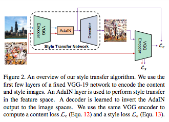

Style Transfer
===

# Image Style Transfer Using Convolutional Neural Networks
- Gatys
- https://arxiv.org/pdf/1508.06576.pdf
- grammatrix
- [details](gatys/README.md)
- 

# Perceptual Losses for Real-Time Style Transfer and Super-Resolution
- https://arxiv.org/pdf/1603.08155v1.pdf
- Justin Johnson, Alexandre Alahi, Li Fei-Fei
- real-time, Perceptual loss
- [details](realtime.style/README.md)
- 

# Instance Normalization: The Missing Ingredient for Fast Stylization
- https://arxiv.org/pdf/1607.08022
- Dmitry Ulyanov
- Instance Normalization
- [details](instance.norm/README.md)

# A Learned Representation For Artistic Style
- Vincent Dumoulin & Jonathon Shlens & Manjunath Kudlur
- https://arxiv.org/pdf/1610.07629
- conditional instance normalization
- [details](learned.style/README.md)
- 

# Arbitrary Style Transfer in Real-time with Adaptive Instance Normalization
- Xun Huang Serge Belongie, Department of Computer Science & Cornell Tech, Cornell University
- https://arxiv.org/pdf/1703.06868.pdf
- adaptive instance normalization (AdaIN)
- [details](adain/README.md)
- 

# Universal Style Transfer via Feature Transforms
- Yijun Li, Chen Fang, Jimei Yang, Zhaowen Wang, Xin Lu, Ming-Hsuan Yang
- https://arxiv.org/pdf/1705.08086.pdf
- WCT
- [details](universal/README.md)
- 
