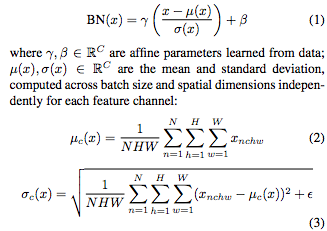
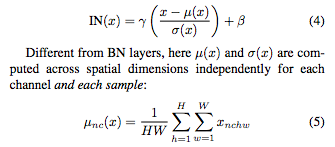
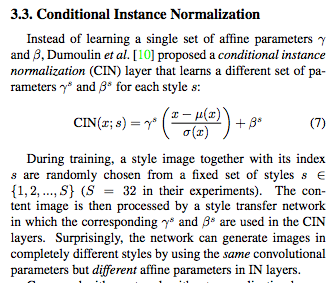
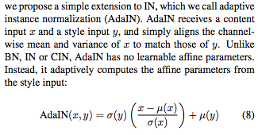
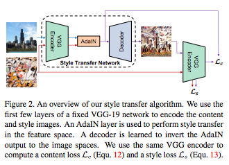
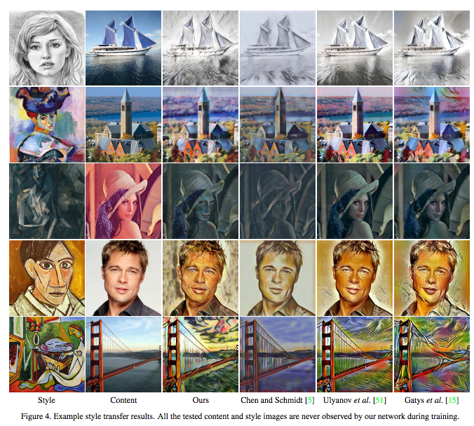
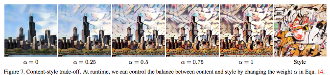
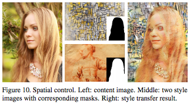

Arbitrary Style Transfer in Real-time with Adaptive Instance Normalization
===

- Xun Huang Serge Belongie
Department of Computer Science & Cornell Tech, Cornell University
- https://arxiv.org/pdf/1703.06868.pdf
- adaptive instance normalization (AdaIN)

normalizations
---

- batch normalization

- instance normalization

- Conditional Instance Normalization

- Adaptive Instance Normalization

## model

## example

## fig

## etc

