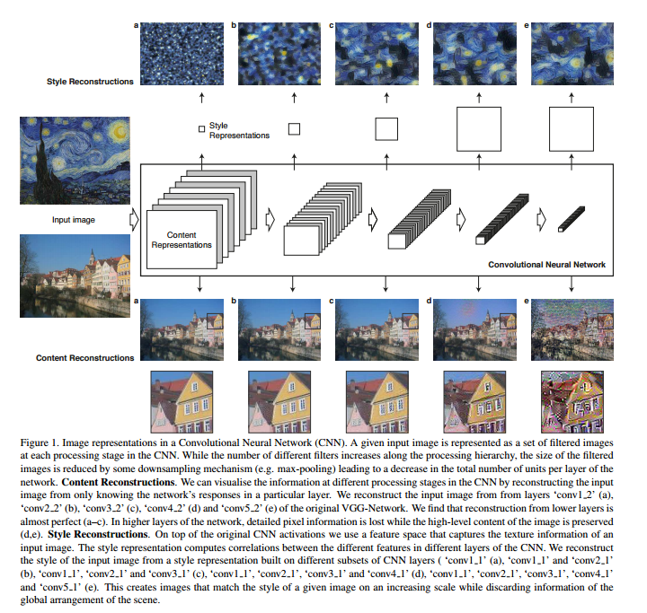
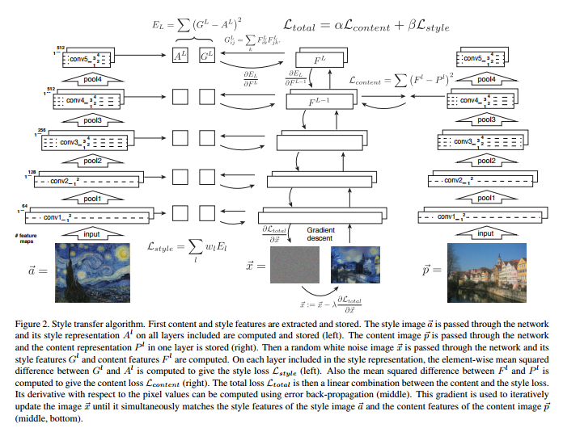
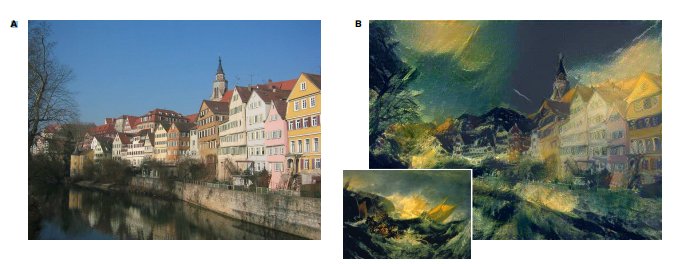
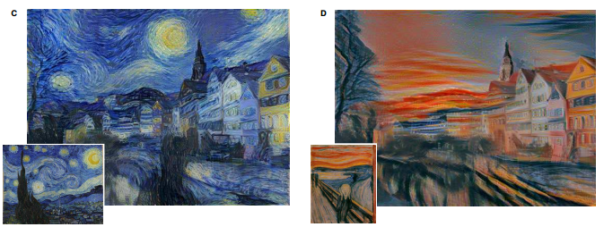
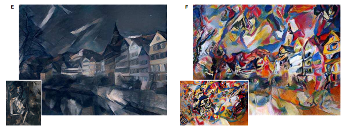
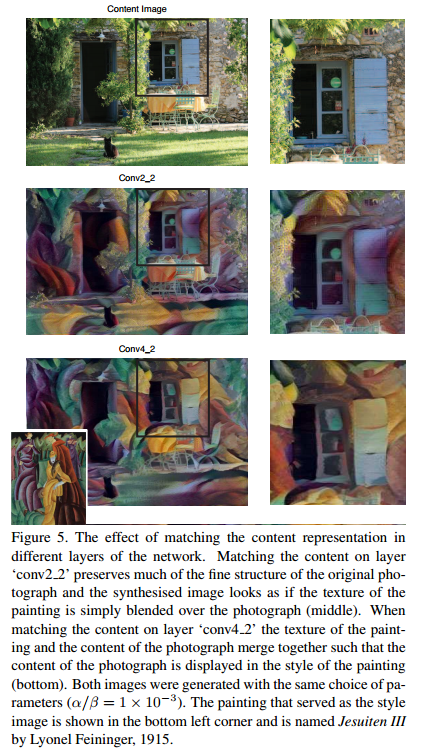
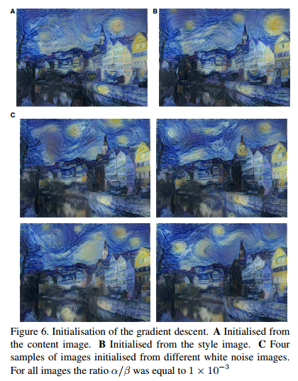
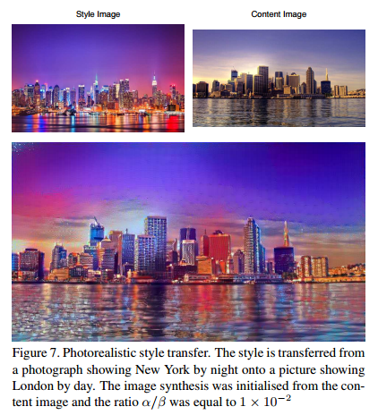

# Image Style Transfer Using Convolutional Neural Networks

- Leon A. Gatys
-  http://www.cv-foundation.org/openaccess/content_cvpr_2016/papers/Gatys_Image_Style_Transfer_CVPR_2016_paper.pdf

## style and content representations

## style transfer

## results

- 
- 
- 

## content representation
- 

## effect of initialisation
- 

## photorelaistic style transfer
- 
