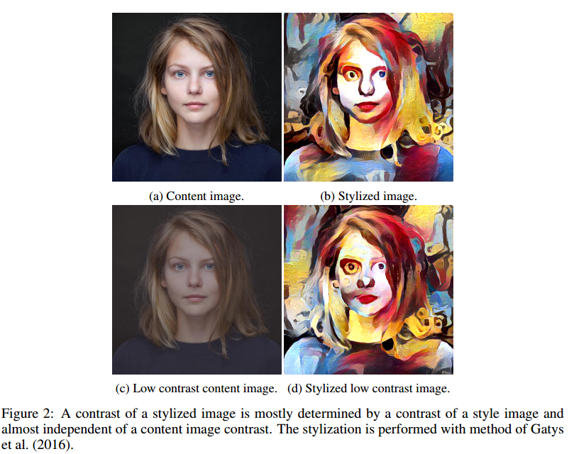
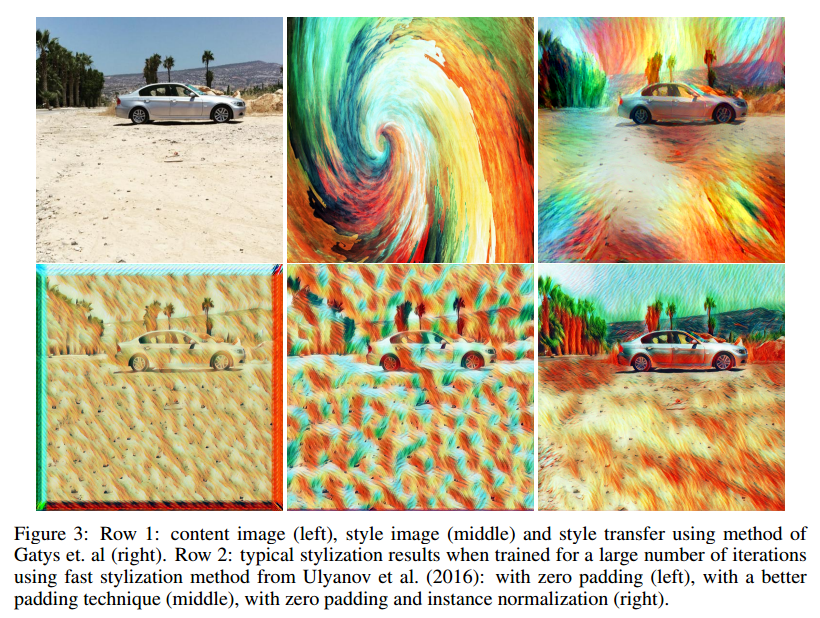
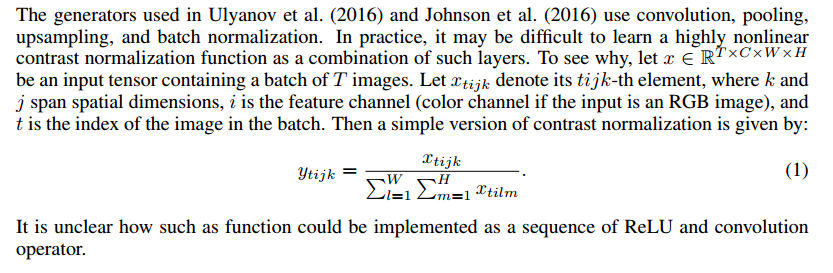
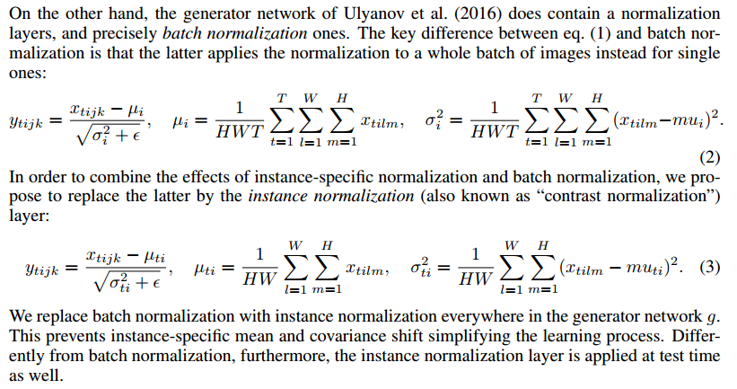
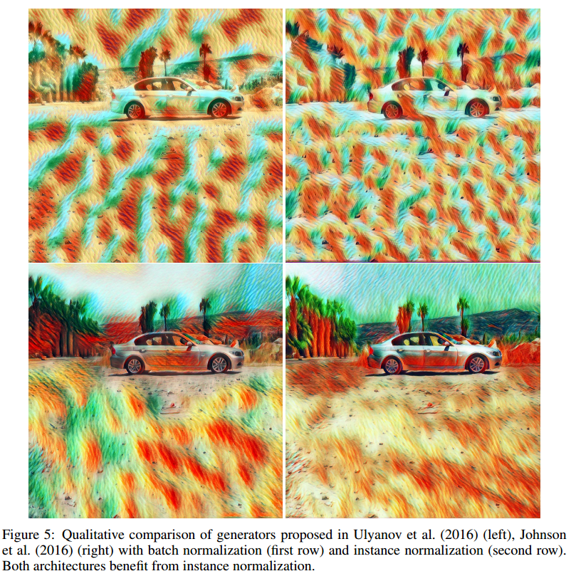
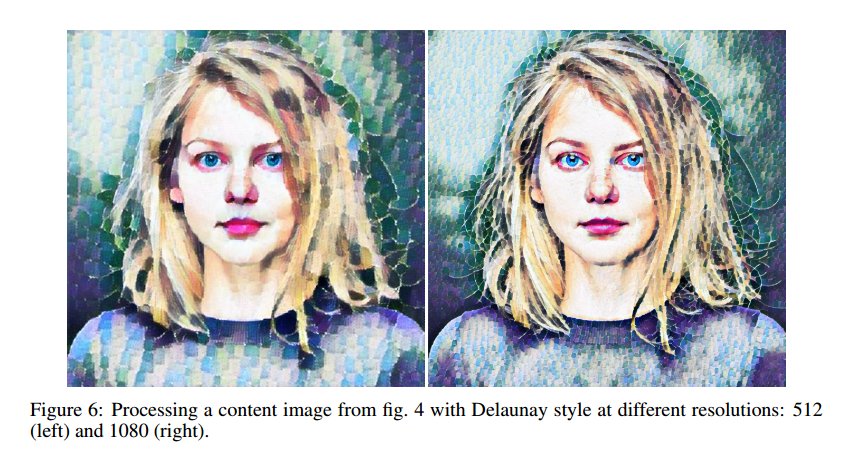

Instance Normalization: The Missing Ingredient for Fast Stylization
===

Dmitry Ulyanov
Computer Vision Group
Skoltech & Yandex
Russia

https://arxiv.org/abs/1607.08022
https://github.com/DmitryUlyanov/texture_nets


```
It this paper we revisit the fast stylization method introduced in Ulyanov et al.
(2016). We show how a small change in the stylization architecture results in a
significant qualitative improvement in the generated images. The change is limited
to swapping batch normalization with instance normalization, and to apply the
latter both at training and testing times. The resulting method can be used to train
high-performance architectures for real-time image generation.
```

```
The key idea (section 2) is to replace batch normalization
layers in the generator architecture with instance normalization layers
and to keep them at test time (as opposed to freeze and simplify them out as done for batch normalization). Intuitively,
the normalization process allows to remove instance-specific contrast information from the content
image, which simplifies generation. In practice, this results in vastly improved images  
```


```
While the generator network g is fast, the authors of Ulyanov et al. (2016) observed that learning it
from too many training examples yield poorer qualitative results. In particular, a network trained on
just 16 example images produced better results than one trained from thousands of those. The most
serious artifacts were found along the border of the image due to the zero padding added before every
convolution operation (see fig. 3)
```

- 

- 

- 

- 

- 

- 
