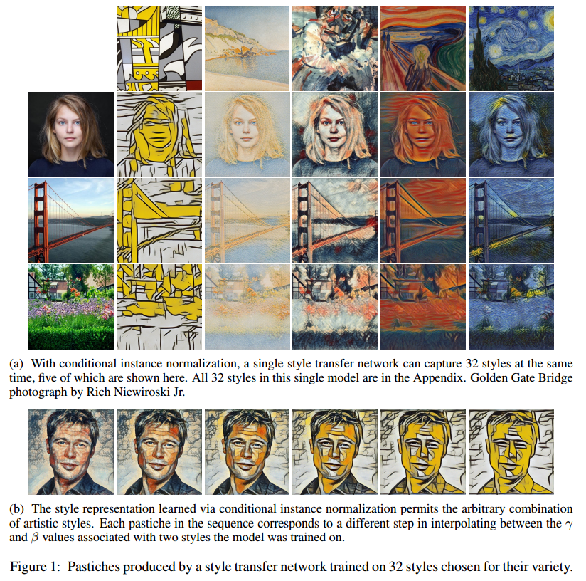
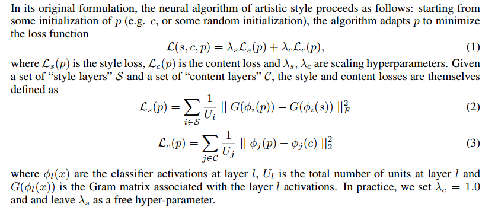
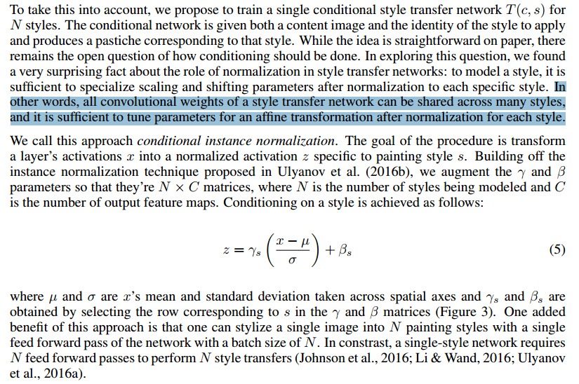
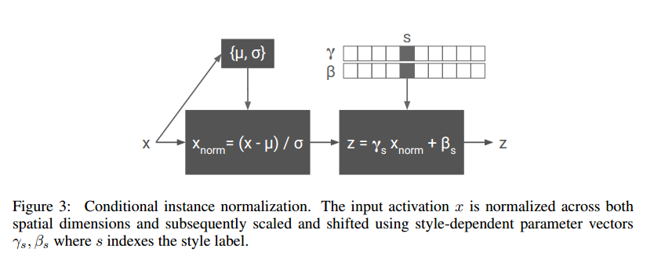
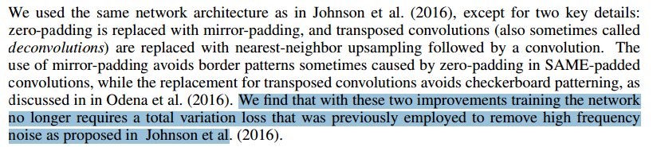
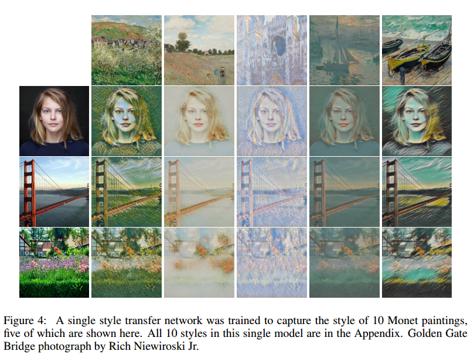
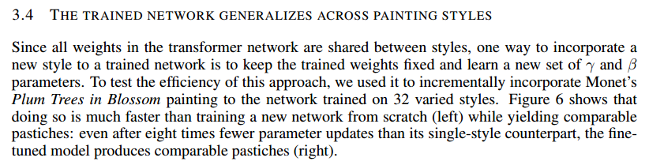
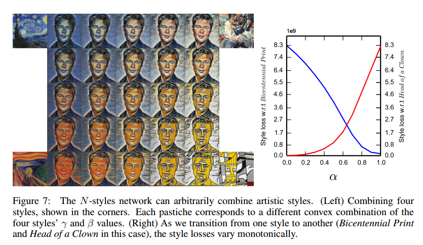
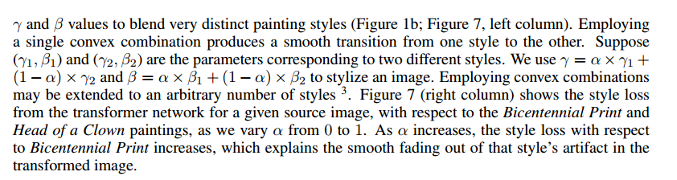

A Learned Representation For Artistic Style
===


- https://arxiv.org/abs/1610.07629
- https://openreview.net/forum?id=BJO-BuT1g
- https://github.com/tensorflow/magenta
- https://www.youtube.com/watch?v=6ZHiARZmiUI

```
The diversity of painting styles represents a rich visual vocabulary for the construction of an image. The degree to which one may learn and parsimoniously capture this visual vocabulary measures our understanding of the higher level features of paintings, if not images in general. In this work we investigate the construction of a single, scalable deep network that can parsimoniously capture the artistic style of a diversity of paintings. We demonstrate that such a network generalizes across a diversity of artistic styles by reducing a painting to a point in an embedding space. Importantly, this model permits a user to explore new painting styles by arbitrarily combining the styles learned from individual paintings. We hope that this work provides a useful step towards building rich models of paintings and offers a window on to the structure of the learned representation of artistic style.

```

```
we show that a simple modification of the style transfer network, namely the introduction
of conditional instance normalization, allows it to learn multiple styles
```

- 

- 

- 

- 

- 

- 

- 

- 

- 

- 
