Texture Networks: Feed-forward Synthesis of Textures and Stylized Images
===

Dmitry Ulyanov DMITRY.ULYANOV@SKOLTECH.RU
Skolkovo Institute of Science and Technology & Yandex, Russia

- https://arxiv.org/abs/1603.03417
- https://github.com/DmitryUlyanov/texture_nets

```
Gatys et al. recently demonstrated that deep networks
can generate beautiful textures and stylized
images from a single texture example. However,
their methods requires a slow and memoryconsuming
optimization process. We propose
here an alternative approach that moves the computational
burden to a learning stage. Given a
single example of a texture, our approach trains
compact feed-forward convolutional networks to
generate multiple samples of the same texture of
arbitrary size and to transfer artistic style from
a given image to any other image. The resulting
networks are remarkably light-weight and
can generate textures of quality comparable to
Gatys et al., but hundreds of times faster. More
generally, our approach highlights the power
and flexibility of generative feed-forward models
trained with complex and expressive loss functions
```

- 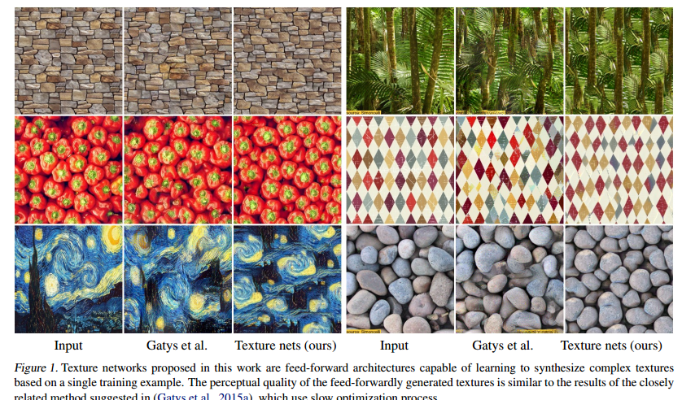

- 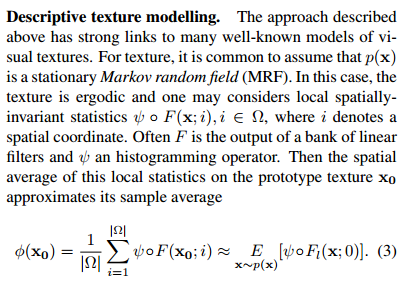

- 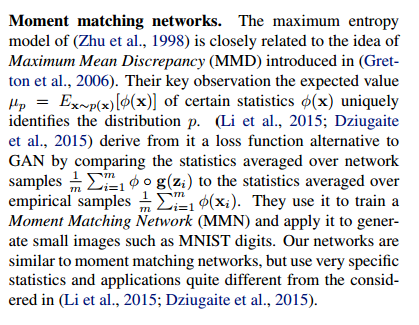

- 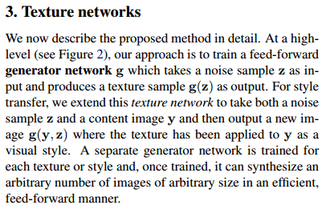

- 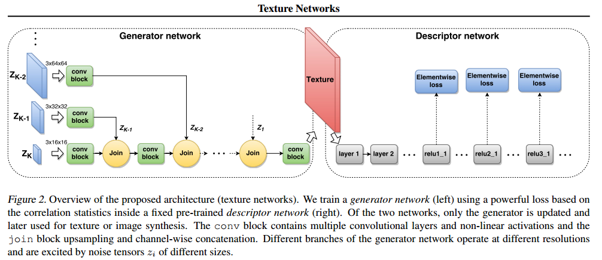

- 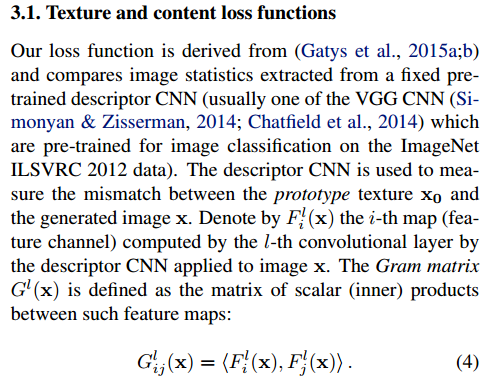

- 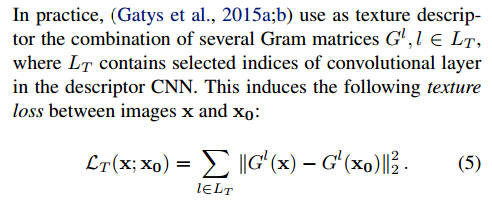

- 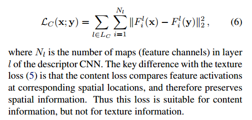

- 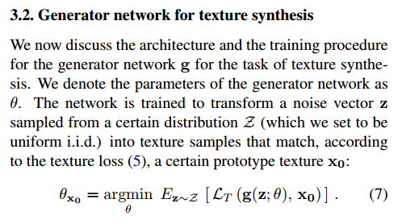

- 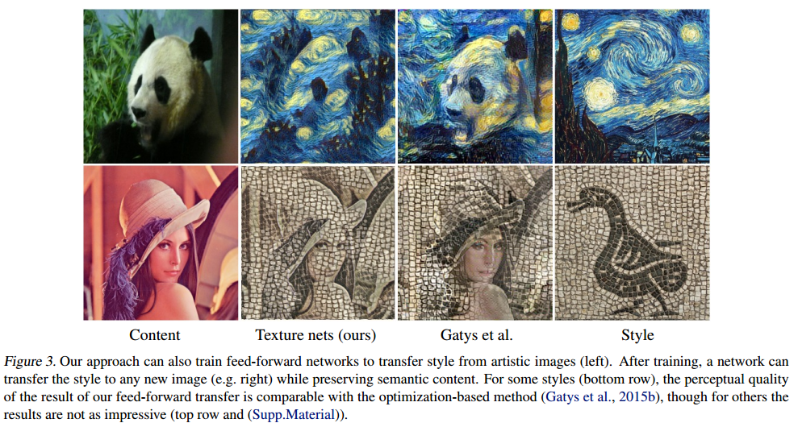

- 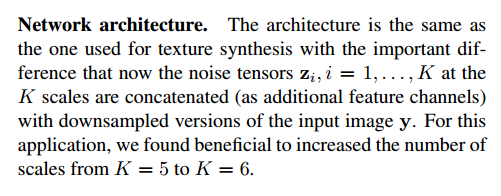
