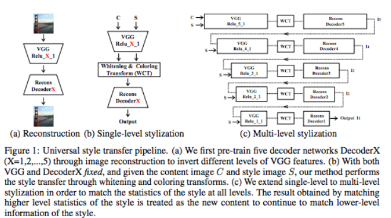

Universal Style Transfer via Feature Transforms
===

- Yijun Li, Chen Fang, Jimei Yang, Zhaowen Wang, Xin Lu, Ming-Hsuan Yang
- https://arxiv.org/pdf/1705.08086.pdf

## model

## WCT
### whitening transform

### coloring transform

## loss

## inverting whitened features

## single-level stylization

## multi-level

